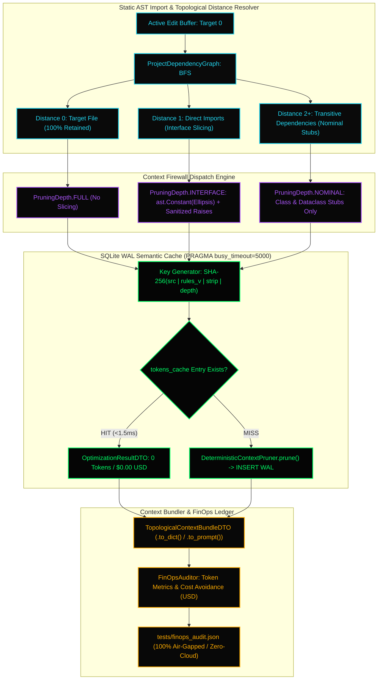

```mermaid
graph TD
    subgraph TopoScan ["Static AST Import & Topological Distance Resolver"]
        TargetFile["Active Edit Buffer: Target 0"] --> GraphBuilder["ProjectDependencyGraph: BFS"]
        GraphBuilder --> D0["Distance 0: Target File (100% Retained)"]
        GraphBuilder --> D1["Distance 1: Direct Imports (Interface Slicing)"]
        GraphBuilder --> D2["Distance 2+: Transitive Dependencies (Nominal Stubs)"]
    end

    subgraph FirewallCore ["Context Firewall Dispatch Engine"]
        D0 --> DispatchFull["PruningDepth.FULL (No Slicing)"]
        D1 --> DispatchInterface["PruningDepth.INTERFACE: ast.Constant(Ellipsis) + Sanitized Raises"]
        D2 --> DispatchNominal["PruningDepth.NOMINAL: Class & Dataclass Stubs Only"]
    end

    subgraph CacheLayer ["SQLite WAL Semantic Cache (PRAGMA busy_timeout=5000)"]
        DispatchFull --> KeyGen["Key Generator: SHA-256(src | rules_v | strip | depth)"]
        DispatchInterface --> KeyGen
        DispatchNominal --> KeyGen
        KeyGen --> CacheCheck{"tokens_cache Entry Exists?"}
        CacheCheck -- "HIT (<1.5ms)" --> WarmHit["OptimizationResultDTO: 0 Tokens / $0.00 USD"]
        CacheCheck -- "MISS" --> ColdStore["DeterministicContextPruner.prune() -> INSERT WAL"]
    end

    subgraph BundleAndLedger ["Context Bundler & FinOps Ledger"]
        WarmHit --> ContextBundle["TopologicalContextBundleDTO (.to_dict() / .to_prompt())"]
        ColdStore --> ContextBundle
        ContextBundle --> FinOps["FinOpsAuditor: Token Metrics & Cost Avoidance (USD)"]
        FinOps --> AuditFile["tests/finops_audit.json (100% Air-Gapped / Zero-Cloud)"]
    end

    classDef topoNode fill:#0a0a0a,stroke:#22d3ee,stroke-width:2px,color:#22d3ee
    classDef firewallNode fill:#080808,stroke:#a855f7,stroke-width:2px,color:#a855f7
    classDef cacheNode fill:#050505,stroke:#00ff66,stroke-width:2px,color:#00ff66
    classDef ledgerNode fill:#080808,stroke:#ffaa00,stroke-width:2px,color:#ffaa00

    class TargetFile,GraphBuilder,D0,D1,D2 topoNode
    class DispatchFull,DispatchInterface,DispatchNominal firewallNode
    class KeyGen,CacheCheck,WarmHit,ColdStore cacheNode
    class ContextBundle,FinOps,AuditFile ledgerNode
```