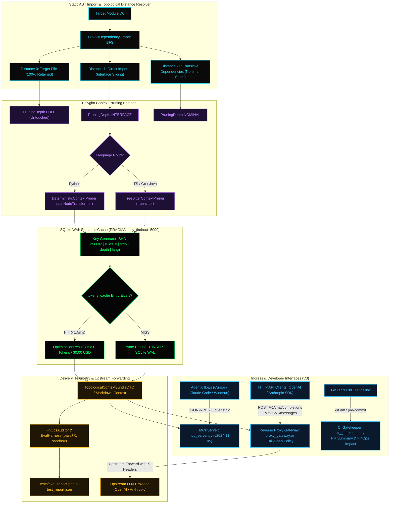

```mermaid
graph TD
    subgraph IngressLayer ["Ingress & Developer Interfaces (V3)"]
        IDE["Agentic IDEs (Cursor / Claude Code / Windsurf)"] -->|JSON-RPC 2.0 over stdio| MCPServer["MCPServer: mcp_server.py (v2024-11-05)"]
        AppClient["HTTP API Clients (OpenAI / Anthropic SDK)"] -->|POST /v1/chat/completions\nPOST /v1/messages| ProxyGateway["Reverse Proxy Gateway: proxy_gateway.py\nFail-Open Policy"]
        CIPipeline["Git PR & CI/CD Pipeline"] -->|git diff / pre-commit| CIGatekeeper["CI Gatekeeper: ci_gatekeeper.py\nPR Summary & FinOps Impact"]
    end

    subgraph TopoScan ["Static AST Import & Topological Distance Resolver"]
        TargetFile["Target Module D0"] --> GraphBuilder["ProjectDependencyGraph: BFS"]
        GraphBuilder --> D0["Distance 0: Target File (100% Retained)"]
        GraphBuilder --> D1["Distance 1: Direct Imports (Interface Slicing)"]
        GraphBuilder --> D2["Distance 2+: Transitive Dependencies (Nominal Stubs)"]
    end

    subgraph PruningEngines ["Polyglot Context Pruning Engines"]
        D0 --> DispatchFull["PruningDepth.FULL (Untouched)"]
        D1 --> DispatchInterface["PruningDepth.INTERFACE"]
        D2 --> DispatchNominal["PruningDepth.NOMINAL"]

        DispatchInterface --> DualRouter{"Language Router"}
        DualRouter -->|Python| ASTPruner["DeterministicContextPruner (ast.NodeTransformer)"]
        DualRouter -->|TS / Go / Java| PolyglotPruner["TreeSitterContextPruner (tree-sitter)"]
    end

    subgraph CacheLayer ["SQLite WAL Semantic Cache (PRAGMA busy_timeout=5000)"]
        ASTPruner --> KeyGen["Key Generator: SHA-256(src | rules_v | strip | depth | lang)"]
        PolyglotPruner --> KeyGen
        KeyGen --> CacheCheck{"tokens_cache Entry Exists?"}
        CacheCheck -- "HIT (<1.5ms)" --> WarmHit["OptimizationResultDTO: 0 Tokens / $0.00 USD"]
        CacheCheck -- "MISS" --> ColdStore["Prune Engine -> INSERT SQLite WAL"]
    end

    subgraph OutboundAndFinOps ["Delivery, Telemetry & Upstream Forwarding"]
        WarmHit --> Bundler["TopologicalContextBundleDTO / Markdown Context"]
        ColdStore --> Bundler
        Bundler --> ProxyGateway
        Bundler --> MCPServer
        Bundler --> FinOps["FinOpsAuditor & EvalHarness (pass@1 sandbox)"]
        FinOps --> EvalReport["tests/eval_report.json & test_report.json"]
        ProxyGateway -->|Upstream Forward with X-Headers| LLMUpstream["Upstream LLM Provider (OpenAI / Anthropic)"]
    end

    classDef ingressNode fill:#0b192c,stroke:#38bdf8,stroke-width:2px,color:#38bdf8
    classDef topoNode fill:#0a0a0a,stroke:#22d3ee,stroke-width:2px,color:#22d3ee
    classDef engineNode fill:#1e1035,stroke:#c084fc,stroke-width:2px,color:#c084fc
    classDef cacheNode fill:#050505,stroke:#00ff66,stroke-width:2px,color:#00ff66
    classDef outboundNode fill:#1f1605,stroke:#fbbf24,stroke-width:2px,color:#fbbf24

    class IDE,AppClient,CIPipeline,MCPServer,ProxyGateway,CIGatekeeper ingressNode
    class TargetFile,GraphBuilder,D0,D1,D2 topoNode
    class DispatchFull,DispatchInterface,DispatchNominal,DualRouter,ASTPruner,PolyglotPruner engineNode
    class KeyGen,CacheCheck,WarmHit,ColdStore cacheNode
    class Bundler,FinOps,EvalReport,LLMUpstream outboundNode
```