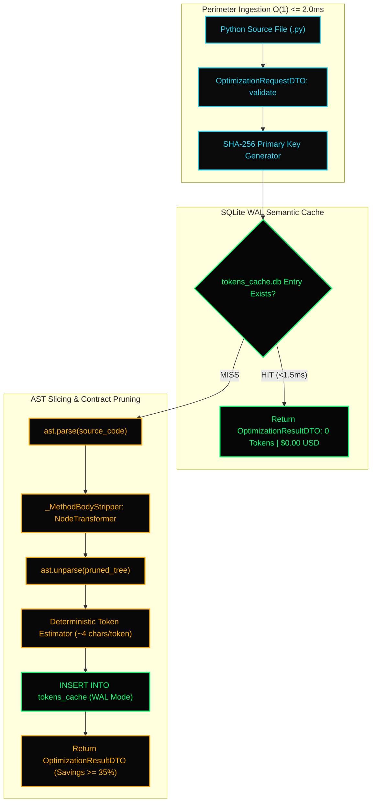

```mermaid
graph TD
    subgraph Ingestion ["Perimeter Ingestion O(1) <= 2.0ms"]
        InboundCode["Python Source File (.py)"] --> InboundDTO["OptimizationRequestDTO: validate"]
        InboundDTO --> KeyGen["SHA-256 Primary Key Generator"]
    end

    subgraph CacheLayer ["SQLite WAL Semantic Cache"]
        KeyGen --> Lookup{"tokens_cache.db Entry Exists?"}
        Lookup -- "HIT (<1.5ms)" --> ZeroCost["Return OptimizationResultDTO: 0 Tokens | $0.00 USD"]
    end

    subgraph ASTCore ["AST Slicing & Contract Pruning"]
        Lookup -- "MISS" --> ASTParse["ast.parse(source_code)"]
        ASTParse --> ASTVisitor["_MethodBodyStripper: NodeTransformer"]
        ASTVisitor --> ASTUnparse["ast.unparse(pruned_tree)"]
        ASTUnparse --> TokenMeter["Deterministic Token Estimator (~4 chars/token)"]
        TokenMeter --> WALPersist["INSERT INTO tokens_cache (WAL Mode)"]
        WALPersist --> ColdDTO["Return OptimizationResultDTO (Savings >= 35%)"]
    end

    classDef ingestNode fill:#0a0a0a,stroke:#22d3ee,stroke-width:2px,color:#22d3ee
    classDef cacheNode fill:#050505,stroke:#00ff66,stroke-width:2px,color:#00ff66
    classDef astNode fill:#080808,stroke:#ffaa00,stroke-width:2px,color:#ffaa00

    class InboundCode,InboundDTO,KeyGen ingestNode
    class Lookup,ZeroCost,WALPersist cacheNode
    class ASTParse,ASTVisitor,ASTUnparse,TokenMeter,ColdDTO astNode
```