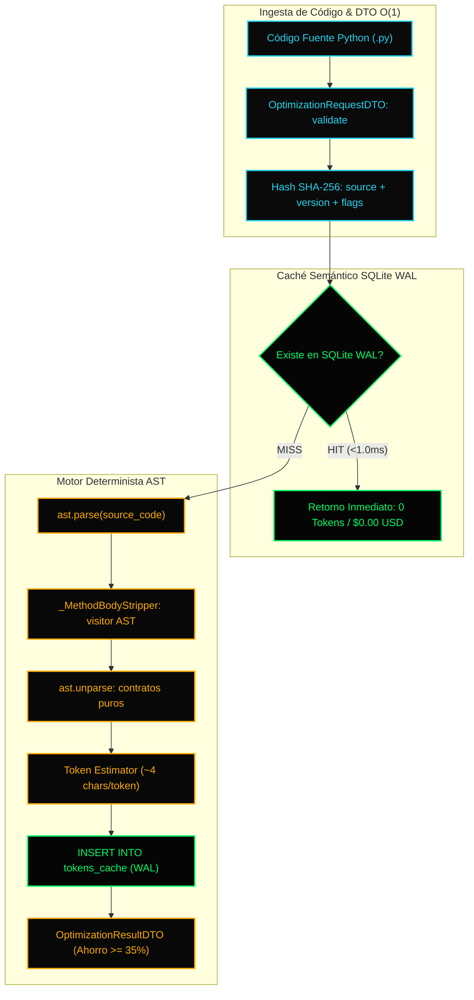

```mermaid
graph TD
    subgraph Ingestion ["Ingesta de Código & DTO O(1)"]
        RawCode["Código Fuente Python (.py)"] --> DTO["OptimizationRequestDTO: validate"]
        DTO --> HashGen["Hash SHA-256: source + version + flags"]
    end

    subgraph CacheLayer ["Caché Semántico SQLite WAL"]
        HashGen --> QueryCache{"Existe en SQLite WAL?"}
        QueryCache -- "HIT (<1.0ms)" --> WarmResult["Retorno Inmediato: 0 Tokens / $0.00 USD"]
    end

    subgraph ASTCore ["Motor Determinista AST"]
        QueryCache -- "MISS" --> ASTParser["ast.parse(source_code)"]
        ASTParser --> BodyStripper["_MethodBodyStripper: visitor AST"]
        BodyStripper --> ContractUnparse["ast.unparse: contratos puros"]
        ContractUnparse --> Estimator["Token Estimator (~4 chars/token)"]
        Estimator --> StoreWAL["INSERT INTO tokens_cache (WAL)"]
        StoreWAL --> ColdResult["OptimizationResultDTO (Ahorro >= 35%)"]
    end

    classDef ingestNode fill:#0a0a0a,stroke:#22d3ee,stroke-width:2px,color:#22d3ee
    classDef cacheNode fill:#050505,stroke:#00ff66,stroke-width:2px,color:#00ff66
    classDef astNode fill:#080808,stroke:#ffaa00,stroke-width:2px,color:#ffaa00

    class RawCode,DTO,HashGen ingestNode
    class QueryCache,WarmResult,StoreWAL cacheNode
    class ASTParser,BodyStripper,ContractUnparse,Estimator,ColdResult astNode
```