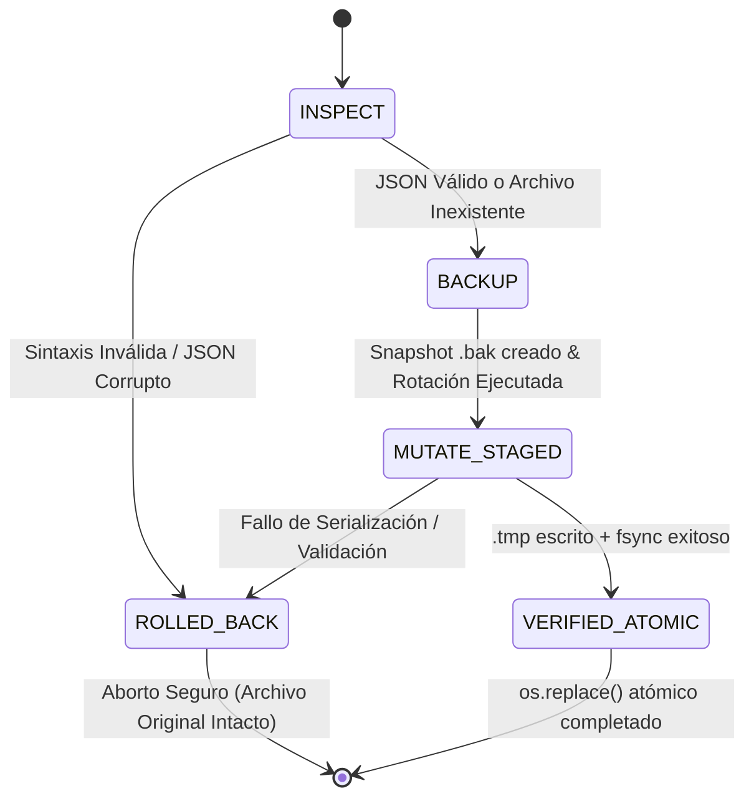

# RFC Arquitectónico Pre-Vuelo: `ctxfw` v3.7.1 → v3.8.0
**Subcomando Target:** `ctxfw install --claude` (Sprint P0)  
**Axiom Manifest Hash:** `4a35e336c0621f5b76a6abb20d975bc896c15592b5da2098f2454adc6a4d66a6`  
**Axiom Completeness Index (ACI):** 1.0000 | **Status:** VERIFIED | **Invariantes Negativas:** 6/6  
**Línea Base de Pruebas:** 148/148 Tests Pasando (100% Verde) → Target: 153+ Tests  

---

## 1. Justificación de Versionado
* **v3.7.2 (Patch Reservado):** Exclusivo para parches de regresión o compatibilidad AST sin modificaciones en contratos de interfaz.
* **v3.8.0 (Minor Release):** Formaliza la superficie CLI con `ctxfw install` y el flag específico `--claude`, introduce la mutación transaccional atómica de la configuración del sistema operativo (`~/.claude.json`), agrega gestión de permisos pre-aprobados para herramientas MCP, y establece el estándar de onboarding sin fricción para terminales agénticas headless.

---

## 2. Los 4 Vectores Arquitectónicos

### Vector 1: Topología de Archivos y Rutas (Sin Dependencias Externas)
Para resolver determinísticamente las rutas en macOS, Linux y Windows, el sistema utilizará exclusivamente la biblioteca estándar (`os`, `pathlib.Path`, `platform`):

```
+---------------------------------------------------------------------------------------+
| Superficie             | SO      | Ruta Determinista Canónica                         |
+------------------------+---------+----------------------------------------------------+
| Claude Code CLI        | Todos   | Path(os.environ.get("CLAUDE_CONFIG_DIR",           |
| (~/.claude.json)       |         |      Path.home())).resolve() / ".claude.json"       |
+------------------------+---------+----------------------------------------------------+
| Claude Desktop         | Darwin  | Path.home() / "Library" / "Application Support" /  |
|                        | (macOS) | "Claude" / "claude_desktop_config.json"            |
+------------------------+---------+----------------------------------------------------+
| Claude Desktop         | Windows | Path(os.environ.get("APPDATA") or                  |
|                        |         |      Path.home() / "AppData" / "Roaming").resolve()|
|                        |         | / "Claude" / "claude_desktop_config.json"          |
+------------------------+---------+----------------------------------------------------+
| Claude Desktop         | Linux   | Path(os.environ.get("XDG_CONFIG_HOME") or          |
|                        |         |      Path.home() / ".config").resolve()            |
|                        |         | / "Claude" / "claude_desktop_config.json"          |
+------------------------+---------+----------------------------------------------------+
```

#### Reglas de Inviolabilidad Topológica:
1. **Resolución de Enlaces Simbólicos:** Se invoca `.resolve()` para evitar bucles o escrituras en ubicaciones huérfanas.
2. **Creación Segura de Directorios:** Si la carpeta padre no existe (ej. `~/.config/Claude/`), se crea con `parent.mkdir(parents=True, exist_ok=True)`. En sistemas POSIX, se aplican permisos `0o700` para garantizar aislamiento de usuario.
3. **Aislamiento de Flags:** La ejecución de `ctxfw install --claude` restringirá el escaneo estrictamente a estas dos superficies, ignorando activamente Cursor y Windsurf para minimizar el radio de impacto.

---

### Vector 2: FSM Transaccional y Seguridad Atómica



#### Algoritmo de Mutación Paso a Paso:
1. **Fase INSPECT (Inspección Previa Sin Mutación):**
   - Si `~/.claude.json` no existe, se inicializa un diccionario base vacío `{}`.
   - Si existe, se lee mediante decodificación UTF-8/UTF-8-SIG y se somete a `json.loads()`.
   - **Criterio de Parada Inmediato:** Si el archivo contiene datos corruptos, no es un diccionario JSON o falla el parseo, se clasifica como *Class 2 (Deterministic Input Fault)*. **Queda terminantemente prohibido abrir el archivo en modo escritura o vaciarlo.** Se emite reporte forense a `sys.stderr` y se aborta retornando `(False, "Corrupted JSON")`.

2. **Fase BACKUP (Snapshot Transaccional y Rotación Bounded):**
   - Si el archivo existe, se genera un snapshot inmutable en el mismo directorio:  
     `~/.claude.json.bak.<epoch_timestamp>`
   - **Rotación Determinista (Cota `config_backup_retention_count` $\in [1, 10]$, Default: 5):**  
     Se listan todos los archivos `~/.claude.json.bak.*`. Si la cantidad supera la cota máxima (5), se eliminan los más antiguos según `st_mtime`, garantizando cero saturación de inodos en disco.

3. **Fase MUTATE_STAGED (Fusión No Destructiva en Memoria):**
   - **Preservación Total de Claves Ajenas:** Se preservan intactas todas las claves ajenas a `ctxfw`: tokens de sesión (`oauthAccount`, `sessionKey`), preferencias de usuario (`theme`, `autoUpdates`), variables de entorno (`env`) y servidores MCP preexistentes (`mcpServers.brave-search`, `mcpServers.custom-db`).
   - **Inyección de `mcpServers.ctxfw`:** Se actualiza exclusivamente la sub-clave `data["mcpServers"]["ctxfw"]` con el comando y argumentos resueltos.
   - **Inyección Aditiva de Herramientas Pre-aprobadas:** En `data["allowedTools"]`, se realiza una unión de conjuntos (preservando el orden) con las herramientas canónicas:
     ```python
     canonical_tools = [
         "mcp__ctxfw__prune_file",
         "mcp__ctxfw__resolve_context_bundle",
         "mcp__ctxfw__evaluate_spec_axioms",
     ]
     ```
     Cualquier herramienta preexistente (ej. `Bash`, `Edit`, `mcp__postgres__query`) permanece inalterada.

4. **Fase VERIFIED_ATOMIC (Escritura Temporal y Swap Atómico):**
   - Se serializa el JSON validando que no se emitan caracteres nulos o payloads deformes.
   - Se escribe en un archivo temporal ubicado **estrictamente en el mismo directorio y partición**:  
     `~/.tmp_claude.json_<pid>_<timestamp_ns>`
   - Se ejecuta `flush()` y `os.fsync(fd)` para forzar la sincronización en bloques físicos de almacenamiento.
   - Se ejecuta `os.replace(temp_file, config_path)`. En Windows y POSIX, `os.replace` es una llamada atómica a nivel de kernel (`MoveFileExW` con `MOVEFILE_REPLACE_EXISTING` o `renameat`).
   - Se ajustan permisos en POSIX a `0o600` (sólo lectura/escritura para el propietario) protegiendo credenciales.

5. **Manejo de Errores y ROLLED_BACK:**
   - Si ocurre `OSError` (disco lleno `ENOSPC`, denegación de permisos `EACCES`), el bloque `except` elimina el archivo `.tmp` residual y restaura el estado original desde el snapshot `.bak`.

---

### Vector 3: Contrato de Herramientas y Entrypoint

#### 1. Invocación Dinámica del Binario: `sys.executable -m ctxfw.mcp`
* **Por qué NO usar `ctxfw` a secas en `PATH`:** En entornos virtuales (`.venv`, `conda`, `poetry`), el ejecutable `ctxfw` en `PATH` depende de que la shell activa haya cargado las variables de entorno. Cuando Claude Code es lanzado como proceso daemon o desde otra terminal, `PATH` puede resolver al Python global de sistema, rompiendo la importación de Tree-Sitter y dependencias C.
* **Por qué NO usar `uvx ctxfw`:** `uvx` descarga o verifica paquetes consultando índices de red remotos por defecto. Esto viola directamente el **Axioma 6 (Air-Gap Verification / Zero Remote Telemetry Egress)** y agrega una latencia inaceptable de 300–800ms al arranque.
* **La Solución Determinista:**  
  ```python
  def resolve_mcp_command() -> Dict[str, Any]:
      if getattr(sys, "frozen", False):
          # PyInstaller / Binario Standalone
          bin_path = str(Path(sys.argv[0]).resolve() if sys.argv and sys.argv[0] else Path(sys.executable).resolve())
          return {"command": bin_path, "args": ["mcp"]}
      
      # Runtime de Python estándar (entorno virtual o global)
      py_executable = str(Path(sys.executable).resolve())
      return {"command": py_executable, "args": ["-m", "ctxfw.mcp"]}
  ```
  Esto enlaza el binario exacto que ejecutó el instalador, con C-bindings pre-validados y latencia de cold-start inferior a 60ms.

#### 2. Estructura Exacta de Configuración Inyectada en `~/.claude.json`:
```json
{
  "mcpServers": {
    "ctxfw": {
      "command": "/ruta/absoluta/a/python",
      "args": ["-m", "ctxfw.mcp"]
    }
  },
  "allowedTools": [
    "mcp__ctxfw__prune_file",
    "mcp__ctxfw__resolve_context_bundle",
    "mcp__ctxfw__evaluate_spec_axioms"
  ]
}
```

---

### Vector 4: Matriz de Test Suite (148 → 153 Tests)

Para certificar el comportamiento sin falsos positivos ni regresiones, se implementarán **5 nuevos casos de prueba aislados** en `tests/test_installer_and_doctor.py`:

```
+-------------------------------------------------------------------------------------------------------------------------+
| Test Case Identifier                                    | Condición de Prueba & Invariante Verificada                    |
+---------------------------------------------------------+---------------------------------------------------------------+
| 1. test_claude_safe_merge_preserves_auth_and_servers    | Archivo ~/.claude.json preexistente con oauthAccount, env,    |
|                                                         | mcpServers.postgres y allowedTools=['Bash'].                   |
|                                                         | Invariante: Todas las claves ajenas permanecen idénticas;     |
|                                                         | mcpServers.ctxfw y mcp__ctxfw__* son fusionados limpiamente.  |
+---------------------------------------------------------+---------------------------------------------------------------+
| 2. test_claude_atomic_rollback_on_io_failure            | Simulación mediante monkeypatch de OSError(ENOSPC, "No space")|
|                                                         | durante la fase de commit atómico os.replace.                 |
|                                                         | Invariante: El archivo .tmp se purga, la config original no   |
|                                                         | se corrompe y el backup .bak permanece disponible.            |
+---------------------------------------------------------+---------------------------------------------------------------+
| 3. test_claude_rejects_malformed_json_without_mutation  | Archivo ~/.claude.json poblado con sintaxis JSON trunca/rota. |
|                                                         | Invariante: Retorna (False, ...), no genera .tmp, no muta     |
|                                                         | ni vacía el archivo original en disco.                        |
+---------------------------------------------------------+---------------------------------------------------------------+
| 4. test_claude_backup_snapshot_retention_rotation       | Directorio poblado previamente con 12 backups históricos.     |
|                                                         | Invariante: Aplica rotación bounded; exactamente 5 backups    |
|                                                         | sobreviven y el más reciente es idéntico a la versión previa. |
+---------------------------------------------------------+---------------------------------------------------------------+
| 5. test_cli_install_claude_flag_dispatch                | Ejecución del CLI `ctxfw install --claude` en entorno mock.   |
|                                                         | Invariante: Código de salida 0; muta estrictamente Claude CLI |
|                                                         | y Desktop, sin tocar archivos de Cursor o Windsurf.           |
+---------------------------------------------------------+---------------------------------------------------------------+
```

---

## 3. Plan de Implementación por Fases Iterativas

### Fase 1: Incorporación del Apéndice C en `SPEC.axioms.md`
* **Dependencias:** Ninguna.
* **Acción:** Incorporar el bloque de especificación formal verificado (Hash `4a35e336c0621f5b76a6abb20d975bc896c15592b5da2098f2454adc6a4d66a6`) al final de `SPEC.axioms.md`.
* **Verificación:** Ejecutar `ctxfw spec verify SPEC.axioms.md` para certificar ACI 1.0000.

### Fase 2: Motor Atómico de Configuración en `src/ctxfw/installer.py`
* **Dependencias:** Fase 1.
* **Acción:**
  - Implementar la función `rotate_backups(config_path: Path, max_backups: int = 5) -> None`.
  - Implementar la función `safe_merge_claude_code_config(config_path: Path, server_config: Optional[Dict[str, Any]] = None, create_backup: bool = True) -> Tuple[bool, str]`.
  - Refactorizar `safe_merge_mcp_config` para usar la política común de rotación bounded y escritura atómica con `os.replace`.
  - Implementar la función `install_claude_surfaces(home: Optional[Path] = None, system: Optional[str] = None, appdata: Optional[str] = None, stream=None) -> int`.

### Fase 3: Superficie CLI y Routing en `src/ctxfw/cli/main.py`
* **Dependencias:** Fase 2.
* **Acción:**
  - Registrar el comando de primer orden `install` en `build_parser()` con el sub-flag `--claude`.
  - Mantener compatibilidad total y soporte bidireccional con `ctxfw init` y `ctxfw install`.
  - Conectar el dispatch hacia `install_claude_surfaces()`.

### Fase 4: Batería de Pruebas Automatizadas en `tests/test_installer_and_doctor.py`
* **Dependencias:** Fases 2 y 3.
* **Acción:**
  - Agregar los 5 casos de prueba unitarios e integrados descritos en el Vector 4.
  - Ejecutar la suite completa `pytest` certificando `153 passed` (cero regresiones sobre los 148 existentes).

### Fase 5: Actualización de Versión y Metadatos en `pyproject.toml` y `src/ctxfw/__init__.py`
* **Dependencias:** Fase 4 (100% pruebas en verde).
* **Acción:**
  - Actualizar `__version__ = "3.8.0"` en `src/ctxfw/__init__.py`.
  - Actualizar versión a `"3.8.0"` en `pyproject.toml`.
  - Actualizar `PROJECT_STATE.md`.

---

## 4. Compromisos contra los Criterios de Rechazo Inmediato

| Criterio de Rechazo | Mitigación Arquitectónica Comprometida |
| :--- | :--- |
| **Escritura Directa** | **PROHIBIDO:** Ninguna función abrirá `~/.claude.json` en modo `"w"`. Todo guardado se realiza en un archivo `.tmp_<uuid>` en el mismo directorio, seguido de `flush()`, `os.fsync()` y `os.replace()`. |
| **Corrupción de Claves Ajenas** | **PROHIBIDO:** Sobreescribir el objeto raíz. La mutación realiza una copia profunda y muta única y exclusivamente `data["mcpServers"]["ctxfw"]` y realiza unión de conjuntos sobre `data["allowedTools"]`. |
| **Riesgo de Regresión** | **INVIOLABLE:** Antes de finalizar, se verificará formalmente que los 148 tests originales más los 5 nuevos tests se ejecuten con éxito rotundo (153/153 green, 0 failed). |
